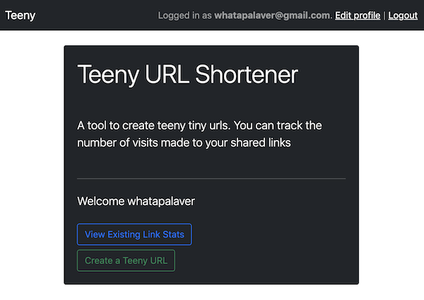
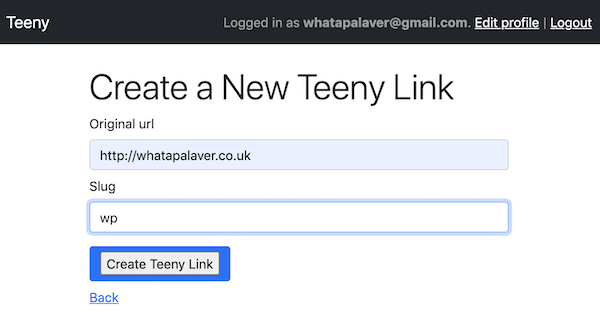
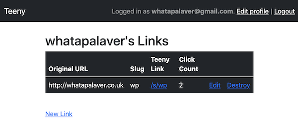

# Teeny a Short Url Generator in Rails 6

## Before you start

- Use RVM to install Ruby 2.6.3
- `bundle install`
- `yarn`

## Setup Database

If you need to create the role 'teeny':

- `psql -d postgres`
- #`create role teeny login createdb;`
- #`\q`

Then setup db:

- `rails db:setup`
- `rails db:seed`
  
## To Run

- `rails s`

The DB has been seeded with a user: username = admin, email = admin@example.com, password = supersecurepass
You can log in with these details to view some created links or register your own account to create your own links

You can view the click stats as well

## To Test

- `rspec` to run the rspec tests
- `cucumber` to run the feature tests

## Discussion Points

- Followed a BDD approach with Cucumber & capybara.
- Used this approach to [test for redirection to Original Url](https://makandracards.com/makandra/15217-test-redirects-to-an-external-url-with-cucumber-capybara)
- Set up short url using a custom route but haven't fathomed how to show domain + path in view
- My click_count appears to be doubled
